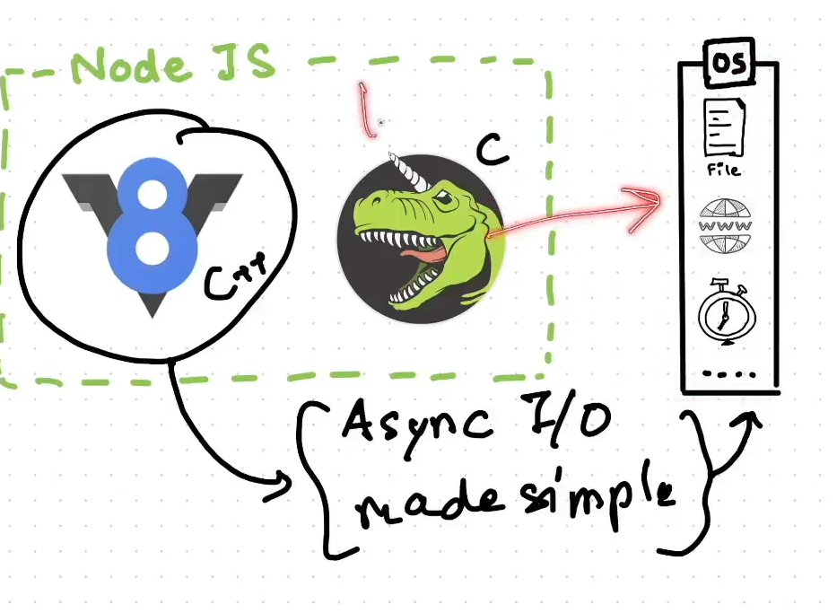
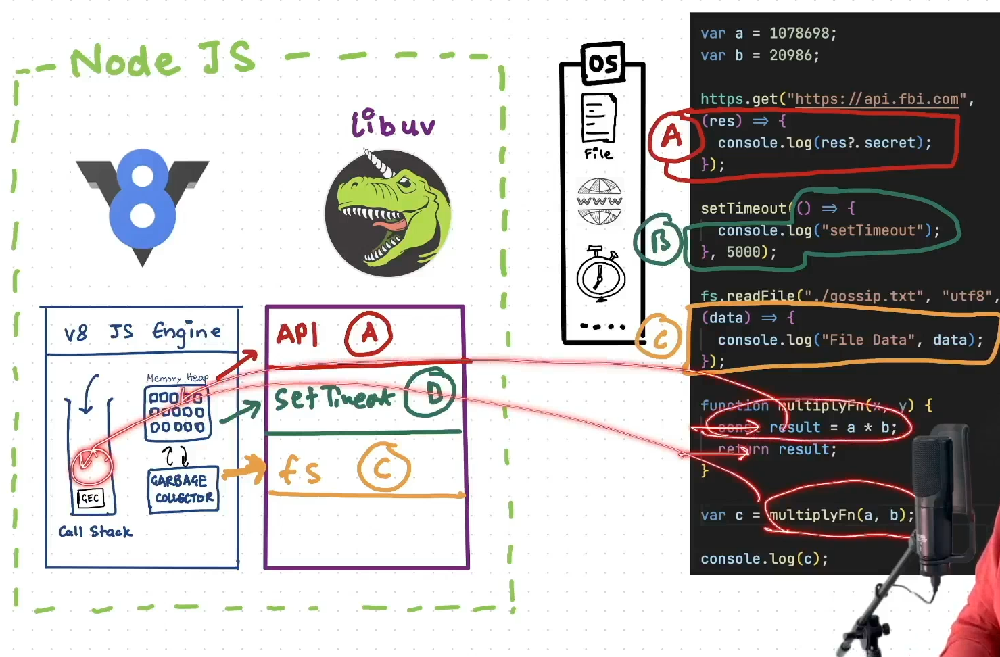
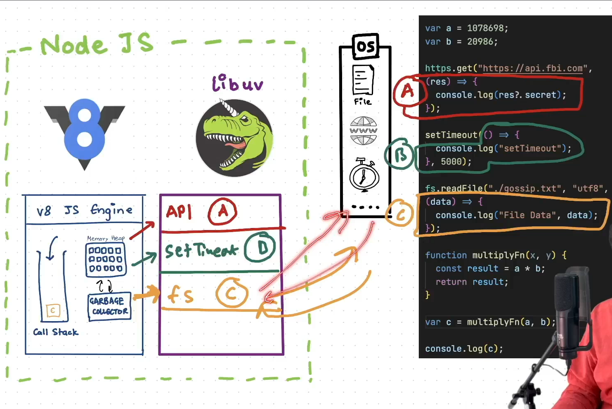

# Notes on require(path) Process

1. **Resolving the Module**
   * Determine the module's location.
   * Can be a local path, a \`.json\` file, or a Node.js module.

2. **Loading the Module**
   * Load the file content based on its type.

3. **Wrapping Inside IIFE**
   * The module is wrapped inside an Immediately Invoked Function Expression (IIFE).

4. **Evaluation**
   * The module code is executed.
   * The result is assigned to \`module.exports\`.

5. **Caching**
   * The loaded module is cached for future use to improve performance.

# V8 JavaScript Engine Overview

The V8 JavaScript engine is a high-performance engine developed by Google, used in Chrome and Node.js. It efficiently processes JavaScript code, focusing on memory management and execution flow.

## Components

1. **V8 JS Engine**:
    - A high-performance JavaScript engine developed by Google, used in Chrome and Node.js.

2. **Memory Heap**:
    - A large region of memory used for storing objects and data structures.
    - The `result` variable is stored here.

3. **Call Stack**:
    - A data structure that keeps track of function calls.
    - Operates in a LIFO (Last In, First Out) manner.
    - The `multiplyFn` function is pushed onto the call stack during execution.

4. **Garbage Collector**:
    - Automatically frees up memory by removing objects that are no longer in use.

## Code Explanation

```javascript
var a = 1078698;
var b = 20986;

function multiplyFn(x, y) {
    const result = a * b;
    return result;
}

var c = multiplyFn(a, b);
```

# LibUV in Node.js

LibUV is a multi-platform support library that provides asynchronous I/O operations in Node.js. It handles operations like file system, networking, and concurrency through an event-driven architecture.

## Key Features

1. **Event Loop**:
    - Manages all asynchronous operations
    - Processes events in phases (timers, I/O callbacks, etc.)

2. **Thread Pool**:
    - Handles CPU-intensive tasks
    - Default size of 4 threads
    - Customizable via UV_THREADPOOL_SIZE

3. **File I/O Operations**:
    - Asynchronous file operations
    - File system events monitoring

4. **Network Operations**:
    - TCP/UDP sockets
    - DNS resolution
    - Inter-process communication

## Example Code

```javascript
const fs = require('fs');

// Example 1: File System Operations
fs.readFile('example.txt', 'utf8', (err, data) => {
    if (err) {
        console.error('Error reading file:', err);
        return;
    }
    console.log('File contents:', data);
});

// Example 2: Network Operations
const http = require('http');

const server = http.createServer((req, res) => {
    res.writeHead(200, { 'Content-Type': 'text/plain' });
    res.end('Hello from LibUV!');
});

server.listen(3000, () => {
    console.log('Server running on port 3000');
});

// Example 3: Timer Operations
setTimeout(() => {
    console.log('Timer executed after 2 seconds');
}, 2000);

### Interview Talking Points

1. **Event Loop Demonstration**:
   - The file read operation shows how LibUV handles I/O operations asynchronously
   - The HTTP server demonstrates network handling capabilities
   - The timer showcases the event loop's phases

2. **Performance Benefits**:
   - File operations don't block the main thread
   - Multiple connections can be handled simultaneously
   - Event-driven architecture enables scalability

3. **Real-world Applications**:
   - Web servers handling multiple concurrent connections
   - File processing applications
   - Real-time applications with multiple I/O operations
```


1. 
2. 

# Asynchronous I/O In Node.js / Non Blocking I/O

## Overview
Asynchronous I/O is a core feature of Node.js that enables non-blocking I/O operations. This allows Node.js to handle multiple operations concurrently without waiting for each operation to complete before moving to the next one.

## Key Components

### 1. Event Loop
The event loop is the core mechanism that handles asynchronous operations:

```javascript
console.log('Start');

setTimeout(() => {
    console.log('Timer finished');
}, 1000);

console.log('End');
```

### 2. Callbacks & Promises
Modern ways to handle async operations:

```javascript
// Using Callbacks
fs.readFile('file.txt', 'utf8', (err, data) => {
    if (err) throw err;
    console.log(data);
});

// Using Promises
async function readFile() {
    try {
        const data = await fs.promises.readFile('file.txt', 'utf8');
        console.log(data);
    } catch (err) {
        console.error(err);
    }
}
```

## How It Works

1. **Event Loop Phases**
   - Timers
   - Pending callbacks
   - Poll (I/O events)
   - Check (setImmediate)
   - Close callbacks

2. **Thread Pool**
   - Managed by libuv
   - Default 4 threads
   - Handles CPU-intensive tasks
   - Configurable via `UV_THREADPOOL_SIZE`

## Best Practices

1. **Avoid Blocking Operations**
```javascript
// Prefer this:
fs.readFile('file.txt', (err, data) => {
    // Handle data
});

// Over this:
const data = fs.readFileSync('file.txt');
```

2. **Use Modern Async Patterns**
```javascript
async function processFile() {
    try {
        const data = await fs.promises.readFile('file.txt');
        return processData(data);
    } catch (error) {
        console.error('Error:', error);
    }
}
```

## Benefits

1. **Scalability**
   - Handles many concurrent operations
   - Efficient resource utilization

2. **Performance**
   - Non-blocking I/O
   - Improved throughput

3. **Use Cases**
   - Web servers
   - Real-time applications
   - API services
   - Streaming applications
   - Microservices